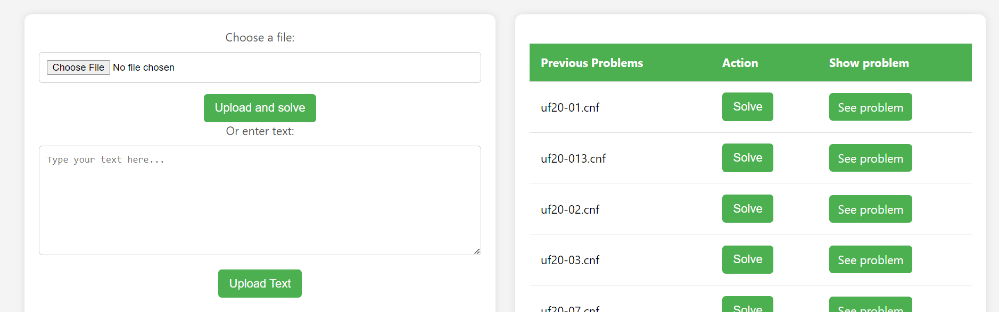

# SAT SOLVER
This project is sat solver which use CDCL aproach to create and solve the model.

There is some uploaded file that you can see them and also solve them by clicking on solve button.
Also you can upload new files after that it will solve and since then you can see them in table. Another aproach is that copy and past your problem in the text area and press the solve button to see the result.

## Run
This is the link of Instance Application that is created to test and show the result of the tested problems.
For running on windows:
pip install -r requirements.txt
py ./main.py

For running on linux:
pip3 install -r requirements.txt
python3 ./main.py

and after that you can see the index page on your local host port 5002
